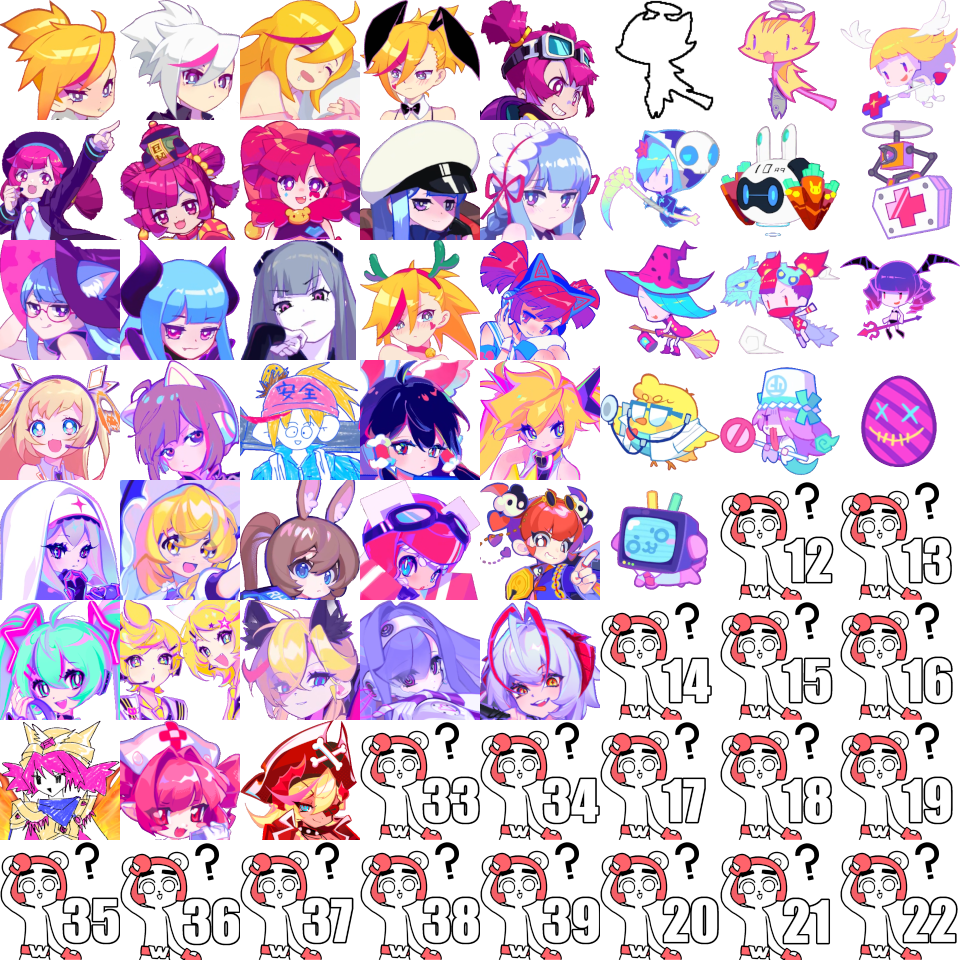

# et cetera
This folder contains stuff that's somewhat related to the development process, but is not included directly in the mod DLL.

## Randomizer for screenshots
[`randomizer-for-screenshots.patch`](./randomizer-for-screenshots.patch) is a git patch that changes loading characters and elfins data from the API response to completely random values. It's used to create screenshots for readme, as the real scoreboards mostly contain few same characters and elfins over and over. If you're not me, this is probably useless.

After re-implementing this again after yet another rendering improvement, I thought it's a good idea to store it for future use.

Note that the hardcoded random maximums are up to date as of game version 3.11.0.

### Usage
- `git apply ScoreboardCharacters/etc/randomizer-for-screenshots.patch`
- build, copy to game's mod folder
- run the game, take screenshots
- discard the changes to `AdditionalScoreboardDataEntry.cs`
- put updated image to repo's readme

To regenerate the patch with the new diff (because it keeps getting outdated, but the general idea stays the same):
- `git diff ScoreboardCharacters/Data/AdditionalScoreboardDataEntry.cs > ScoreboardCharacters/etc/randomizer-for-screenshots.patch`

## Spritesheet source
[`sprites.png`](./sprites.png) is the reference spritesheet:

It has 120×120 sprites – that would be proper size for a hypothetical 5760×3240 display resolution. Only scaled down versions for common resolutions are included in the mod DLL, see [`ScoreboardCharacters/Resources`](../Resources) folder.

### Sprites placement
The spritesheet is 8 sprites in width: the first 5 columns are used for the character sprites, and the last 3 for the elfin sprites. Please note that elfins sprites include "no elfin" sprite (in-game id `-1`) before the elfin with id `0` (Mio Sir). There are also placeholders for possible future characters and/or elfins so there will be _something_ on the buttons if the mod is outdated. If there will be more characters or elfins than the current image can fit, it will be extended downwards, adding more rows as necessary.

### Automatic resizing
There are scripts to automate generation of scaled down versions from the reference image. These will work out of the box only with ~~Green Is My Pepper~~ [GNU Image Manipulation Program](https://www.gimp.org/) run via [Flatpak](https://flatpak.org/), adjust if necessary.

#### Actual resizing script
[`gimp-resize.scm`](gimp-resize.scm) is a script for GIMP to perform the scaling I did by hand up to this point automatically. It defines a specific scale function which is called to create an image for every supported screen resolution (currently 720, 1080, 1440, and 2160).

#### Shortcut script
[`do-resize.sh`](do-resize.sh) is a shortcut to invoke GIMP in non-interactive processing mode. It's actually more of a command saved for later than a script.

It's specific to my setup, so it's not in the build pipeline.

### Placeholder
[`placeholder.xcf`](./placeholder.xcf) is the source for the placeholder sprites at the bottom of the spritesheet.

#### XCF?
That's the native format of GIMP, which I use to edit the spritesheet and produce high(er than before) quality downscaled versions to display in the game.

#### Other requirements
You'll need to have Impact font available. For Windows, it's included by default; for other systems, look up "corefonts".

#### Usage
_(at least thats's how I do it; I'm not exactly an image editing pro, so there might be easier and faster way ¯\\\_(ツ)\_/¯)_
- change the text on the text layer (the top one) to desired value
- select the text
- switch to the second layer ("THE stroke")
- `Edit → Stroke Selection...`, line width should be 16 px, color should be #000000
- resize the entire image to 120×120 to put on the spritesheet

### Image credit
All character and elfin images are sourced from screenshots of the game itself.  
The placeholder image "bear man doubts" is a part of "Daily Life of the RMB from Muse Dash 1.0" stickers pack, [available for download on the official site](https://musedash.peropero.net/#/special/stickers).
