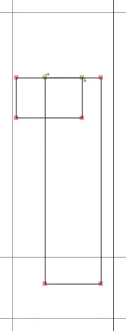
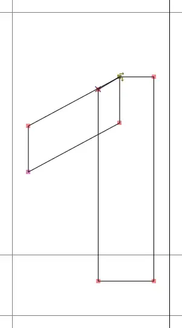
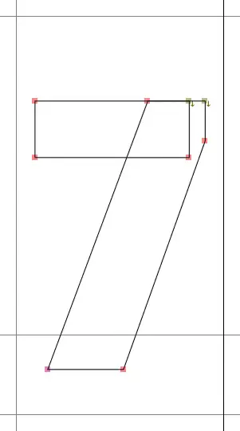

# et cetera
This folder contains stuff that's somewhat related to the development process, but is not included directly in the mod DLL.

## Font source
[`Teko-Bold-mono-numbers-take-4.ttf`](./Teko-Bold-mono-numbers-take-4.ttf) is the custom font used for tabular numbers.  
(the name was supposed to be temporary, but I'm so done with that I don't even care to change it now)

### Changes
The font the game uses (as of 5.8.0) for most of its (English) UI is [Teko](https://fonts.google.com/specimen/Teko), a font distributed under the free [SIL OFL 1.1](https://fonts.google.com/specimen/Teko/license) license.

While most of its numbers are roughly the same width already, its "1" is very narrow, so I decided to "fix" that.

Using [FontForge](https://fontforge.org/), I removed most of the symbols from the font, leaving only numbers and some of the symbols, like "." and "%" required for the scoreboard usage. I also modified the shape of "one", so it looks less like a "seven" when stretched wider. If the horizontal line comes down, it's totally not a "seven", right?

| Original one | Custom one | Original-ish seven |
| :---: | :---: | :---: |
|  |  |  |

The seven symbol (like most of the numbers) was slightly widened to match the widest number (four), and centered within the space.

Font editing is fun (I'm not sure whether I want to put "fun" in quotes there).

### Packing
This TTF file is baked into an <abbr title="Signed Distance Field">SDF</abbr> atlas, which Unity uses to render the font.  
The only way to load a non-system font at runtime is to pack it into an [asset bundle](https://docs.unity3d.com/2019.4/Documentation/Manual/AssetBundlesIntro.html). To do so, one _must_ use a Unity Editor (making this the first time ever I used it).

The [asset bundle I created](../Resources/tekomononumbers) is then embedded into the mod's DLL like other custom resources, and the font is loaded from it at runtime when needed. It's loaded only once per game session and cached.

## Further reading
- [A nice article on SDF by Red Blob Games.](https://www.redblobgames.com/x/2403-distance-field-fonts/)