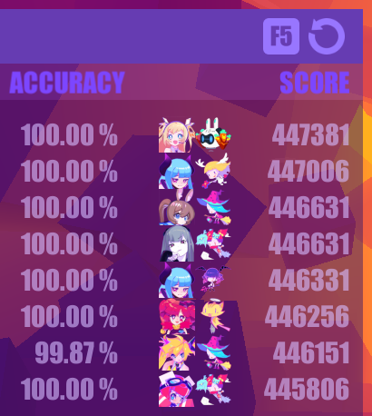
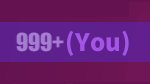
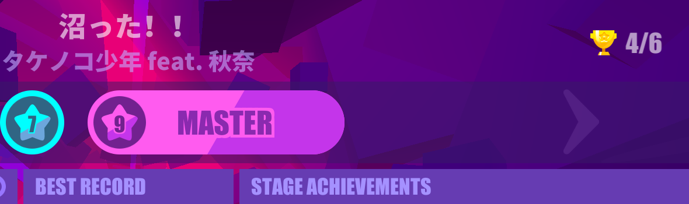
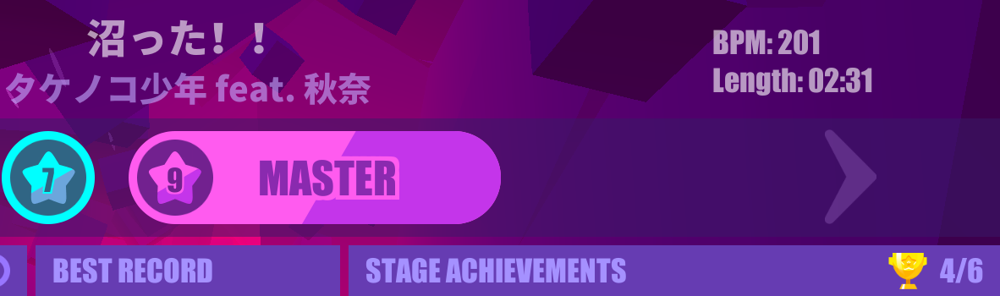
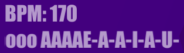

Unofficial quality of life modifications for the PC version of the hit video game Muse Dash using MelonLoader.

# Disclaimers
- These mods are unofficial and are not associated with, related to, and/or endorsed by peropero, hasuhasu, and/or XD.
- USE AT YOUR OWN RISK. NO WARRANTIES.
- Please read [FAQ](#frequently-asked-questions) and have a look at [known issues](https://github.com/bnfour/md-mods/issues).

# Mod list
This repo currently contains five mods. They can be used in any combination.

- [Scoreboard characters](#scoreboard-characters) — shows character/elfin info on the scoreboard
- [True rank](#true-rank) — changes "999+" in the scoreboard to an actual rank
- [Album scroll](#album-scroll) — enables to scroll through current album using Shift keys
- [Song info](#song-info) — shows song's BPM and duration
- [UI tweaks](#ui-tweaks) — tweaks the UI in various small ways

## Scoreboard characters
Mod file: `ScoreboardCharacters.dll`, also requires `UserLibs` DLLs

This mod adds buttons to show character and elfin used to obtain the score to the in-game scoreboard:



These buttons can be clicked, and will set your current character and elfin to these on the button. It will even scroll the selection screens for you.

### Image override (advanced)
If you don't like the provided default images on the buttons or the way they are scaled on your screen resolution, an override spritesheet can be provided to the mod to display.

<details>
<summary>Details</summary>

The overriding is designed to **not** apply any scaling to the images, and the sprites will be placed to the buttons as is.

#### Image preparation
A good way to start with an override is to use the default spritesheet for your resolution as a template. The defaults are located in [`ScoreboardCharacters/Resources`](ScoreboardCharacters/Resources) folder. There's also a bigger source and/or reference image in [`ScoreboardCharacters/etc`](ScoreboardCharacters/etc).

If there is no default image for your desired resolution, the source/reference can be scaled to form a template. The rest of this section describes the requirements the override image must meet; see ["Image override"](#image-override) for the way to enable the override image.

##### Sprite size
First, pick a size for individual sprites. It's best to use the size that matches the button size for your screen resolution. As a baseline, 〇×1080 resolution uses 40 px sprites. Scale this for your resolution.

For example, 2560×1440 screen size will work best with  
40 × 1440 / 1080 = 53 px  
sprite size.

##### Spritesheet resolution
The spritesheet must have 8 sprites (5 characters, 3 elfins) per row -- its width should be 8 times the width of a single sprite. The height must also be divisible by the sprite size, as the sprites are square.  
There should be enough rows to cover all existing characters and elfins; for now, an 8×8 grid will suffice, as shown by default spritesheets.

Continuing the example, the size of custom spritesheet for 2560×1440 should be:
- width: 8 × 53 = 424 px
- height: 8 × 53 = 424 px

##### Sprites placement
Use the [reference image](ScoreboardCharacters/etc/sprites.png) to place the sprites on the spritesheet. The sprites with numbers on them are placeholders for possible future updates, it's not mandatory to fill them in an override.

#### Image override
To apply the override, place your custom spritesheet as `scoreboard_characters_override.png` to `MuseDash_Data` directory of the game install. You'll see a warning in the console if its dimensions differ from expected values. If you don't see your custom images in the game and there's nothing in the console, double-check the file name and location.

</details>

## True rank
Mod file: `TrueAbove1kRank.dll`

This small mod changes mysterious "999+" text in your own scoreboard entry to your actual rank if it lies within 1000–2000 range:
| Before | After |
| --- | --- |
|  |  |

> [!NOTE]
> The game servers only track top 2000 entries. If you score less, there's nothing this mod can do.

## Album scroll
Mod file: `AlbumScroll.dll`

This mod adds an option to quickly scroll to the next album in the song selection menu. Just hold Shift key while scrolling (A/D, ←/→, mouse wheel, on-screen buttons — works with all of these). This will scroll to the closest song from a different album.

Here's a little demo of switching entire albums by single Shift+Arrow key taps:

https://github.com/bnfour/md-mods/assets/853426/92bb0375-95cb-40d3-81a8-8972ba9207af

> [!TIP]
> It's best to use single taps to scroll albums.
>  
> This mod does not play well with "hold to scroll" feature. It might skip an album if a direction key is held long enough to trigger continuous scrolling mode.

## Song info
Mod file: `SongInfo.dll`

This mod adds song's BPM and duration display to the song info screen:

| State | Illustration |
| --- | --- |
| Before |  |
| After |  |

> [!NOTE]  
> The duration is approximate (defined as "the duration of the actual music file used") and does not include the "Music-Ready-Go!" intro. The "Full combo" outro _seems_ to be included though.

### Cache (ab)use (advanced; also useless)
For technical reasons, it is possible to replace the song duration with an arbitrary string. Why though?

<details>
<summary>Details</summary>

This mod uses an external file to store the lengths of the songs obtained locally from the game data. This happens when new songs are added to the game and the mod's built in database becomes outdated. Usually, direct access to game data is avoided because it's a slow operation that slightly lags the game. When song's length is acquired locally, it's cached in an external file.

The file, `song_info_override.json`, is stored in `MuseDash_Data` directory of the game install. If there are no overrides to store, the file will not be present.

After a mod update, the gathered overrides are automatically removed from the file if they match with the updated default data. The file itself is removed if no overrides remain.

However, the mod _currently_ does not remove overrides that do not match its own data. Therefore, it's possible to store arbitrary strings in there to be displayed instead of a song's length.

The file itself is a simple string to string JSON dictionary:
- the key is a song's so called `uid`; a string in `{album id}-{song id}` format
- the value is the string to display; _supposed_ to be the song length

For instance, if the cache file contains
```json
{
  "8-1": "O-oooooooooo AAAAE-A-A-I-A-U- JO-oooooooooooo AAE-O-A-A-U-U-A- E-eee-ee-eee AAAAE-A-E-I-E-A-JO-ooo-oo-oo-oo EEEEO-A-AAA-AAAA"
}
```
the data for Brain Power will look like this:



Yes, the field is set up for scrolling longer strings ¯\\\_(ツ)\_/¯.

To revert to the default display, just remove the entry from the overrides file, ot the file itself.
 
If `song_info_override.json` does not contain valid JSON in expected format, a warning will be displayed at startup. The file will get overwritten by mod if it encounters a song it doesn't have data for — it will be stored in the file.

</details>

## UI tweaks
Mod file: `UITweaks.dll`

This mod is a collection of various cosmetic changes to the game UI that fix a particular "I can't unsee this (╯°□°)╯︵ ┻━┻" issue. They are bundled together only to keep the mod count manageable; each feature can be toggled on and off independently of others.

There are currently three UI tweaks available.

### Wider album names
This feature widens the space for the song's album name on the song selection screen, so wider names fit without scrolling. Only intended for English locale.

| Before | After |
| --- | --- |
| TODO | TODO |

<details>
<summary>List of affected albums (in no particular order)</summary>

- [Happy Otaku Pack]s Vol.10 and beyond
- [Give Up Treatment] packs, all volumes
- [Legends of Muse Warriors]
- [COSMIC RADIO PEROLIST]
- [CHUNITHM COURSE MUSE]
- [Let's Do Bad Things Together]
- [Budget Is Burning: Nano Core]
- [maimai DX Limited-time Suite]

</details>

### Achievement icons sync
This feature synchronizes the spinning cup achievement icons on song info screen. By default, these easily go out of sync on difficulty level switching.

| Before | After |
| --- | --- |
| TODO | TODO |

The difference is clearly seen on last frames of both videos.

<details>
<summary>Why does it get out of sync in the first place?</summary>

The icons are reused between difficulty levels on this screen. The icon for the first achievement is shared between all three difficulty levels; the icon for the second achievement is shared between Hard and Master difficulty levels. By default, whenever the icon appears on the screen, its animation starts from beginning, regardless of any other icons, which may keep their animation state from another difficulty level.

This mod feature corrects this by matching the state of new icons to the state of previously active icons (if any) on difficulty level switches.

</details>

### HP and Fever bars animation sync
This feature syncs the "bubble flow" animation between HP and Fever bars.

TODO table comparison with both modes. (layout?)

> [!NOTE]  
> This does not include the Touhou danmaku mode, as a different texture for ~~Fever~~ Spell bar is used. In [Bad Apple!!]'s black-and-white mode the bubbles are invisible on the Fever bar, so the mod's effect is not noticeable.

#### Alternative mode
By default, Fever bar's texture is modified to match the default HP bar's one. If `SyncHpFeverAnimAlt` is set to true, the reverse will be done: HP bar's texture will be modified instead. This is purely cosmetic.

### Configuration
This mod's prefereneces are used to toggle the mods. In addition, the alternative mode for HP/Fever sync has its own toggle.

The preferences are stored in MelonLoader's default preferences file, `UserData/MelonPreferences.cfg` (relative to game's root directiry). Launching the game with the mod installed should create the following section in the file:
```toml
[Bnfour_UITweaks]
# Enables wider album titles on song selection screen.
WiderAlbumTitles = true
# Syncs the spinning cup images for song achievements.
AchievementIconsSync = true
# Syncs the bubble animation for HP and Fever bars.
SyncHpFeverAnim = true
# Syncs HP bar to Fever bar.
SyncHpFeverAnimAlt = false
```
By default, all toggleable features are enabled. Set a relevant value to `false` to disable a feature.

> [!NOTE]  
> The mod will notify you when all its features are disabled, so it does nothing.

## Experimental mod (not included in the download)
This is not a mod intended for using. Rather, it's a developmental test bed for me to test random stuff without disruption to existing proper mods. For instance, Album scroll and UI tweaks mods were first implemented (in a very scuffed way; no, I won't show the code ⇀‸↼‶) here and then moved to their own permanent projects.

The project contains the bare minimum for a mod that is successfully loaded; it does nothing except posting a single message in the log.

# Installation
These are [MelonLoader](https://melonwiki.xyz/) mods. In order to run these, you need to have it installed. Currently, 0.6.1 Open-Beta of MelonLoader is supported.  
Once you have MelonLoader installed, drop the DLLs of desired mods into the `Mods` folder. Remove to uninstall.  

> [!NOTE]
> Scoreboard characters mod also requires SkiaSharp libraries to be placed in `UserLibs` folder. These libraries are included in the download.

Rather than downloading the mods, I suggest (reviewing the source and) building them yourself — this way you'll be sure the mods behave as described. See ["Building from source"](#building-from-source).  
Otherwise, please verify the downloads.

## Verification
Every published release is accompanied with SHA256 hashes of every DLL. MelonLoader does print these in console when loading mods, but I suggest to verify the hashes before installation.

# Frequently Asked Questions
(or, more accurately, "I thought you may want to know this")

### Is this cheating?
_tl;dr: no_

The scoreboard mods show the information the game already receives directly from its API, it's just not shown anywhere by default. You can already get this info, for instance, from [musedash.moe](https://musedash.moe/) scoreboard. In fact, this repo is born from my frustration of having to mirror my track selection in-game to the website on another display. The Album scroll mod only affects the song selection menu. The Song info mod is simply displaying the data from game, too. All UI tweaks are purely cosmetic. All mods provide no gameplay advantage.  
You still have to git gud to earn high scores.

Unless you count _any_ changes to the game for _any_ purpose as cheating, this is not cheating.

### Will I get banned for using these?
_tl;dr: probably not, but NO WARRANTIES; USE AT YOUR OWN RISK_

As I stated in previous question, I don't believe this is cheating. I've been using these continiously, and my account is still there. But there's a reason for the all-caps section of the license about having no warranties: the devs might think otherwise or break the compatibility (un)intentionally.

Remember that you're using the mods **at your own risk**. I have warned you many times in this readme.

### I have other mods. What about compatibility with them?
_tl;dr: ¯\\\_(ツ)\_/¯_

The mods are pretty much self-contained, so I think ("think" being the operative word here) they will work with other mods, unless those other mods change the vanilla code too much.

### My game is broken because of you and your mods, how can I fix this and blame you?
_tl;dr: uninstall, and remember: NO WARRANTIES_

If you just want to play the game, removing the mods (and maybe the modloader itself) is always an option.
* Please make sure you're using supported (**0.6.1**) version of MelonLoader.
* Try to remove mods not from this repo.
* Try to remove mods and/or modloader and check whether the vanilla game is broken too.

If none of these helps, feel free to submit an issue, unless the problem was already reported.

# Building from source
This repo is a run-of-the-mill .NET solution targeting .NET 6.

The only gotcha is that some libraries required to build it are not included because of file size (and licensing) issues. Your installation of MelonLoader will generate them for you.

Copy everything from `MelonLoader/Managed`, `MelonLoader/Il2CppAssemblies`, and `MelonLoader/net6` folders from the game install to the `references` folder of this repo. All the DLLs should be directly in the `references` folder, no subfolders.

This should cover the local references for all the projects. (Actually, **most** of the DLLs are not necessary to build the solution, I just don't plan on keeping an accurate and up to date list of required libraries.)

After that, just run `dotnet build`.

## Enabling SkiaSharp for Scoreboard characters
Scoreboard characters mod uses SkiaSharp library ([GitHub](https://github.com/mono/SkiaSharp/), [main package NuGet](https://www.nuget.org/packages/SkiaSharp), [used native libs NuGet](https://www.nuget.org/packages/SkiaSharp.NativeAssets.Win32)) for image editing. Its DLLs (`SkiaSharp.dll`, `libSkiaSharp.dll`) should be placed in `UserLibs` folder of the modded game install. SkiaSharp is MIT-licensed, and I include these in downloads for convenience.

If you want to get these straight from NuGet instead, you can use `dotnet publish` command:
```bash
dotnet publish -c Release -r win-x64 --no-self-contained ScoreboardCharacters/ScoreboardCharacters.csproj
```
The SkiaSharp DLLs will be in `ScoreboardCharacters/bin/Release/net6.0/win-x64/publish` folder.

Why `win-x64` runtime? There is no native Muse Dash version for GNU/Linux, and I run the game via Proton, so the Windows binaries should work on both Windows and GNU/Linux for the time being. [Mac? No idea.](https://tenor.com/view/13786657)

You can also extract the DLLs from the nupkg files manually. Remember to look for `net6.0` and `win-x64` monikers.
