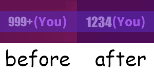

Unofficial quality of life modifications for the PC version of the hit video game Muse Dash using MelonLoader.

# Disclaimers
* These mods are unofficial and are not associated with, related to, and/or endorsed by peropero, hasuhasu, and/or XD.
* USE AT YOUR OWN RISK. NO WARRANTIES.
* Please read [FAQ](#frequently-asked-questions) and have a look at [known issues](https://github.com/bnfour/md-mods/issues).

# Mod list
Currently, this repo contains three mods: two are scoreboard related, and another one enhances song select screen. They can be used together.

## Scoreboard characters
Mod file: `ScoreboardCharacters.dll`

This mod adds buttons to show charater and elfin used to obtain the score to the in-game scoreboard:

These buttons can be clicked, and will set your current character and elfin to these on the button. It will even scroll the selection screens for you.

### Image overload
If you don't like the provided default images on the buttons (my quick and dirty cropped screenshots of the selection screen; devs please let me know if this is an infrigiment before firing a complaint), they can be changed to anything you want, as long as it fits a square image.

To override the default builtin image, place a 960×960 PNG named `scoreboard_characters_override.png` to `MuseDash_Data` directory of the game install. Individual sprites are 120×120, see `ScoreboardCharacters/Resources/sprites.png` for a reference for spritesheet placement.  
The override will be silently ignored if anything differs from expected values. If you don't see your custom images in the game, please double-check the file name, location, and resolution.

## True rank
Mod file: `TrueAbove1kRank.dll`

This small mod changes mysterious "999+" text in your own scoreboard entry to your actual rank if it lies within 1000–2000 range:

Please note that the game servers only track top 2000 entries. If you score less, it won't be tracked and there's nothing this mod can do.

## Album scroll
Mod file: `AlbumScroll.dll`

This mod adds an option to quickly scroll to the next album in the song selection menu. Just hold Shift key while scrolling (A/D, ←/→, mouse wheel, on-screen buttons — this mods works with all of these). This will scroll to the closest song from a different album.

Please note that this mod does not play well with "hold to scroll" feature. It might skip an album if a direction key is held long enough to trigger continuous scrolling mode. It's best to use single taps with this mod.

## Experimental mod
This is not a mod intended for using. Rather, it's a developmental test bed for me to test random stuff without changing existing proper mods. For instance, Album scroll mod was first implemented (in a very scuffed way) in this project and then moved to it's own permanent project. 

# Installation
These are [MelonLoader](https://melonwiki.xyz/) mods. In order to run these, you need to have it installed. **Only 0.5.7 version of MelonLoader is supported** for now, absolutely no idea about compatibility with newer versions.  
Once you have MelonLoader installed, drop the DLLs of desired mods into the mods folder. Remove to uninstall.

Rather than downloading these, I suggest (reviewing the source and) building them yourself — this way you'll be sure the mods behave as described. See ["Building from source"](#building-from-source).  
Otherwise, please verify the downloads.

## Verification
Every published release is accompanied with SHA256 hashes of every DLL. MelonLoader does print these in console when loading mods, but I suggest to verify the hashes before installation.

# Frequently Asked Questions
(or, more accurately, "I thought you may want to know this")

### Is this cheating?
_tl;dr: no_

These mods show the information the game already receives directly from its API, it's just not shown anywhere by default. You can already get this info, for instance, from [musedash.moe](https://musedash.moe/) scoreboard. In fact, this repo is born from my frustration of having to mirror my track selection in-game to the website on another display.  
The mods provide no advantage for the actual gameplay, only some convinence in track selection stage. You still have to git gud to earn high scores; you just know what character to pick and where exactly on the scoreboard you are.

Unless you count _any_ changes to the game for _any_ purpose as cheating, this is not cheating.

### Will I get banned for using these?
_tl;dr: probably not, but NO WARRANTIES; USE AT YOUR OWN RISK_

As I stated in previous question, I don't believe this is cheating. I've been using these continiously, and my account is still there. But there's a reason for the all-caps section of the license about having no warranties: the devs might think otherwise or break the compatibility (un)intentionally.  

Remember that you're using the mods **at your own risk**. I have warned you many times in this readme.

### I have other mods. What about compatibility with them?
_tl;dr: ¯\\\_(ツ)\_/¯_

The mods are pretty much self-contained, so I think ("think" being the operative word here) they will work with other ones, unless the other mods change the default scoreboard components or character selection logic.

### My game is broken because of you and your mods, how can I blame you?
_tl;dr: uninstall, and remember: NO WARRANTIES_

* Please make sure you're using supported **(0.5.7)** version of MelonLoader.
* If you're playing on GNU/Linux via Proton, setting its version to 7 might help with modloader compatibility.
* Try to remove mods not from this repo.
* Try to remove the mods and check whether the vanilla game is broken too.

If none of these helps, feel free to submit an issue, unless it's already have been reported.

If you just want to play the game, removing the mods (and maybe the modloader itself) is always an option.

# Building from source
This repo is a run-of-the-mill .NET solution targeting .NET 4.7.2.

The only gotcha is that some libraries required to build it are not included because of file size (and licensing) issues. Your installation of MelonLoader will generate them for you:
* Copy all files from `MelonLoader/Managed` folder from the game install to the `references` folder of this repo.
* Copy `MelonLoader.dll` from `MelonLoader` folder from the game install to the `references` folder of this repo.

This should cover the local references in both mods. (Actually, most of the files from `Managed` folder are not necessary to build the solution, I just don't plan on keeping an accurate and up to date list of required libraries.)

After that, just run `dotnet build`.
