Unofficial quality of life modifications for the PC version of the hit video game Muse Dash using MelonLoader.

# Disclaimers
- These mods are unofficial and are not associated with, related to, and/or endorsed by peropero, hasuhasu, and/or XD.
- USE AT YOUR OWN RISK. NO WARRANTIES.
- Please read [FAQ](#frequently-asked-questions) and have a look at [known issues](https://github.com/bnfour/md-mods/issues).

# Mod list
This repo currently contains the following mods. They can be used in any combination.

- [Scoreboard characters](#scoreboard-characters) — shows character/elfin info on the scoreboard
- [True rank](#true-rank) — changes "999+" in the scoreboard to an actual rank
- [Album scroll](#album-scroll) — enables to scroll through current album using Shift keys
- [Song info](#song-info) — shows song's BPM and duration
- [Rank preview](#rank-preview) — shows achieved rank on the stats screen
- [UI tweaks](#ui-tweaks) — tweaks the UI in various small ways

## Scoreboard characters
Mod file: `ScoreboardCharacters.dll`, also requires `UserLibs` DLLs

This mod adds buttons to show character and elfin used to the in-game scoreboard:


It will even scroll the selection screens for you.

As you can see, the character and elfin switch UI and random mode toggle are moved to the top of the scoreboard panel; current character and elfin text is replaced with an icon.

### Image override (advanced)
If you don't like the provided default images on the buttons or the way they are scaled on your screen resolution, an override spritesheet can be provided to the mod to display.

<details>
<summary>Details</summary>

The overriding is designed to **not** apply any scaling to the images, and the sprites will be placed to the buttons as is.

#### Image preparation
A good way to start with an override is to use the default spritesheet for your resolution as a template. The defaults are located in [`ScoreboardCharacters/Resources`](ScoreboardCharacters/Resources) folder. There's also a bigger source and/or reference image in [`ScoreboardCharacters/etc`](ScoreboardCharacters/etc).

If there is no default image for your desired resolution, the source/reference can be scaled to form a template. The rest of this section describes the requirements the override image must meet; see ["Image override"](#image-override) for the way to enable the override image.

##### Sprite size
First, pick a size for individual sprites. It's best to use the size that matches the button size for your screen resolution. As a baseline, 〇×1080 resolution uses 40 px sprites. Scale this for your resolution.

For example, 2560×1440 screen size will work best with $40 \times \frac{1440}{1080} = 53$ px sprite size.

##### Spritesheet resolution
The spritesheet must have 8 sprites (5 characters, 3 elfins) per row — its width should be 8 times the width of a single sprite. The height must also be divisible by the sprite size, as the sprites are square.  
There should be enough rows to cover all existing characters and elfins; for now, an 8×8 grid will suffice, as shown by default spritesheets.

Continuing the example, the size of custom spritesheet for 2560×1440 should be:
- width: $8 \times 53 = 424$ px
- height: $8 \times 53 = 424$ px

##### Sprites placement
Use the [reference image](ScoreboardCharacters/etc/sprites.png) to place the sprites on the spritesheet. The sprites with numbers on them are placeholders for possible future updates, it's not mandatory to fill them in an override.

#### Image override
To apply the override, place your custom spritesheet as `scoreboard_characters_override.png` to `MuseDash_Data` directory of the game install. You'll see a warning in the console if its dimensions differ from expected values. If you don't see your custom images in the game and there's nothing in the console, double-check the file name and location.

</details>

## True rank
Mod file: `TrueAbove1kRank.dll`

This small mod changes mysterious "999+" text in your own scoreboard entry to your actual rank if it lies within 1000–2000 range:
| Before | After |
| --- | --- |
| 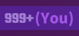 | 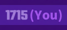 |

> [!NOTE]
> The game servers only track top 2000 entries. If you score less, there's nothing this mod can do.

## Album scroll
Mod file: `AlbumScroll.dll`

This mod adds an option to quickly scroll to the next album in the song selection menu. Just hold <kbd>Shift</kbd> key while scrolling (<kbd>A</kbd>/<kbd>D</kbd>, <kbd>←</kbd>/<kbd>→</kbd>, mouse wheel, on-screen buttons — works with all of these). This will scroll to the closest song from a different album.

Here's a little demo of switching entire albums by single <kbd>Shift</kbd>+<kbd>arrow</kbd> taps:

https://github.com/user-attachments/assets/fed3c930-f7c5-402f-a342-b64a10bf0ac9

> [!TIP]
> It's best to use single taps to scroll albums.
>  
> This mod does not play well with "hold to scroll" feature. It might skip an album if a direction key is held long enough to trigger continuous scrolling mode.

## Song info
Mod file: `SongInfo.dll`

This mod adds song's BPM and duration display to the song info screen. Multiple layouts available:

| Top right (symmetrical with level designer label) | Best record panel |
| :---: | :---: |
| **Default, no Scoreboard characters**<br/>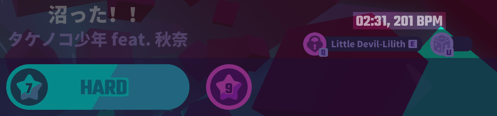<hr/>**"Classic" layout, Scoreboard characters required**<br/>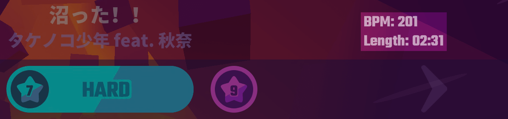 | 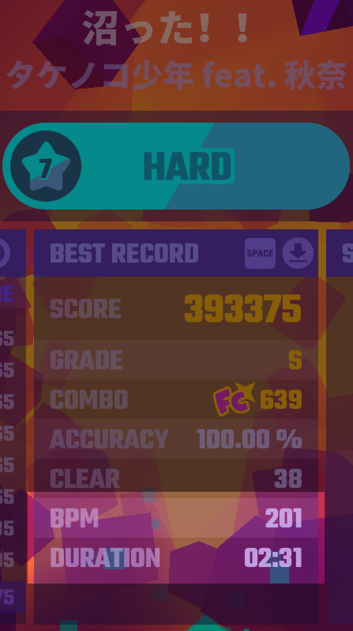 |

- ↖️ "Default" one line layout in the top-right corner that does not clip with the vanilla character select UI.  
Okay to use whether Scoreboard characters mod is installed or not.
- ↙️ "Classic" two lines layout in the top-right corner, used to be the only option for earlier versions.  
**Overlaps** with the vanilla character select UI — requires installation of Scoreboard characters to move the UI out of the way.
- ➡️ "Alternative" two lines layout that moves the data to Best record panel, below the level statistics.  
Also okay to use whenever.

> [!NOTE]
> The song duration shown is approximate (defined as "the duration of the actual music file used") and does not include the "Music-Ready-Go!!" intro. The "Full combo" outro _seems_ to be included though.  
> BPM is taken straight from the game data as is.

### Configuration

The layout preference is stored in MelonLoader's default preferences file, `UserData/MelonPreferences.cfg` (relative to game's root directory). Launching the game with the mod installed should create the following section in the file:
```toml
[Bnfour_SongInfo]
# Sets the layout to use. "OneLine", "TwoLines", or "BestRecord". Classic two line layout requires Scoreboard characters to move the overlapping vanilla UI.
Layout = "OneLine"
```

Set the value of `Layout` to `"TwoLines"` (note the quotes) for the classic layout, or to `"BestRecord"` to move the data to the middle of the screen below the statistics. `"OneLine"` is the default.

### Cache (ab)use (advanced; also useless)
<details>
<summary>For technical reasons, it is possible to replace the song duration with an arbitrary string. Why though?</summary>

This mod uses an external file to store the lengths of the songs obtained locally from the game data. This happens when new songs are added to the game and the mod's built-in database becomes outdated. Usually, direct access to game data is avoided because it's a relatively slow operation that slightly lags the game. When it's done, the results are saved for reuse.

The file, `song_info_override.json`, is stored in `MuseDash_Data` directory of the game install. If there are no overrides to store, the file will not be present.

After a mod update, local overrides are automatically removed from the file if they match with the updated built-in data. The file itself is removed if no overrides remain.

However, the mod _currently_ does not remove overrides that do not match its own data. Therefore, it's possible to store arbitrary strings in there, and the mod will display these as "song duration".

The file itself is a simple string to string JSON dictionary:
- the key is a song's so called `uid`; a string in `{album id}-{song id}` format
- the value is the string to display; _supposed_ to be the song's length in `mm:ss` format

For instance, if the cache file contains:
```json
{
  "8-1": "O-oooooooooo AAAAE-A-A-I-A-U- JO-oooooooooooo AAE-O-A-A-U-U-A- E-eee-ee-eee AAAAE-A-E-I-E-A-JO-ooo-oo-oo-oo EEEEO-A-AAA-AAAA"
}
```
Then, data for Brain Power will look similar to this (newer versions of the game use different font):


Yes, the fields are set up for scrolling longer strings (technically, these are clones of the level designer string, so the heavy work was done by peropero — thanks I guess ¯\\\_(ツ)\_/¯).

To revert to the default display, just remove the entry from the overrides file, ot the file itself.

If `song_info_override.json` does not contain valid JSON in expected format, a warning will be displayed at startup. The file will get overwritten by mod if it encounters a song it doesn't have data for — it will be stored in the file.

</details>

## Rank preview
Mod file: `RankPreview.dll`

This mod adds a small textfield with a predicted* scoreboard rank to the song clear screen next to the achieved score, so you don't have to exit back to the song select to check it; and can just restart straight away if wanted:

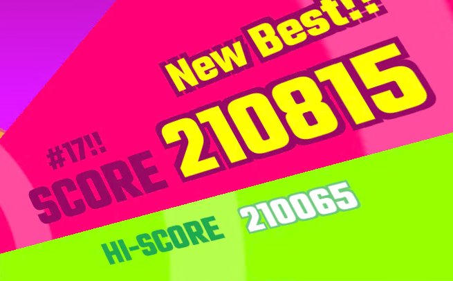

_*may not be totally accurate in certain circumstances_

> [!TIP]
> This mod is not very useful unless you consistently score top 100 worthy results seen on the in-game scoreboard.  
> All other ranks are reported simply as `#100+`, be it #101, #1999, or even a score of 0.

Please note the following caveats:
- The score is compared to a snapshot of the scoreboard visible on preparation panel _as it were before starting the song._  
In order for the mod to work, allow the scoreboard to load before starting the song. The mod will report `¯\_(ツ)_/¯` as a rank if the scoreboard state was not stored.
- The mod simply compares achieved score with the scoreboard state as is.  
The predicted rank is the position the score would be placed, _if eligible_ (as in "there is no better score already"). If there is a better score, it is **not** excluded, so the predicted rank in that case is more of "what rank would someone else get if this score were his best record?".

In addition, the mod may add a few `!` and/or `?` characters to the rank, depending on its "impressiveness" and "uncertainty" (all numbers inclusive):
| level ╲ stat | Impressive? | Uncertain? |
| ---: | :---: | :---: |
| Default | ` `<br/>ranks 51–∞ | ` `<br/>91–100 scoreboard entries |
| Somewhat | `!`<br/>ranks 21–50 | `?`<br/>51–90 scoreboard entries |
| Yes | `!!`<br/>ranks 9–20 | `??`<br/>1–50 scoreboard entries |
| Very | `!!!`<br/>ranks 1–8<br/>(visible without scrolling) | `???`<br/>no scoreboard entries at all<br/>(or the scoreboards are broken again) |

Impressiveness is just an arbitrary categorization for the ranks for discern at glance.

Uncertainty is mostly relevant for newly released songs just after a game update. For instance, playing a just released song with no scoreboard entries yet will "predict" `#1!!!???` regardless of the score — others might have achieved greater scores at the same time, but there's no way for this mod to know until the scoreboard is reloaded.

## UI tweaks
Mod file: `UITweaks.dll`

This mod is a collection of various cosmetic changes to the game UI that fix a particular "I can't unsee this (╯°□°)╯︵ ┻━┻" issue I noticed. They are bundled together only to keep the mod count manageable.

The following UI tweaks are currently available:
- [Wider album titles](#wider-album-titles) for song selection screen
- [Achievement icons sync](#achievement-icons-sync) for song info screen
- [HP and Fever bars animation sync](#hp-and-fever-bars-animation-sync) for in-game UI
- [Notice for automatic fever](#notice-for-automatic-fever) for in-game UI
- [Options menu text case](#options-menu-text-case)
- [Achievements header styling](#achievements-header-styling) for song info screen
- [Character and elfin select appearance animation](#character-and-elfin-select-appearance-animation) for song info screen

Each feature can be toggled on and off independently of others.

### Wider album titles
This feature slightly widens the space for the album title on the song selection screen, so that even notoriously long "MD-level Tactical Training Blu-ray" fits:

| State | Illustration |
| --- | :---: |
| _(Context)_ | 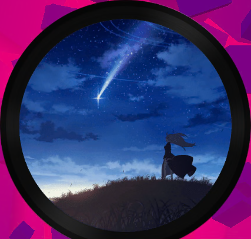
| Before | _(no idea why it's like this lol)_ <br/>  |
| After |  |

> [!NOTE]
> This feature is intended to be used with English locale.

### Achievement icons sync
This feature synchronizes the spinning award achievement icons on song info screen. By default, these easily go out of sync:  
(achievements header modified by [one of UI tweaks](#achievements-header-styling))

Before:

https://github.com/user-attachments/assets/97dac033-f012-4264-988b-97a1e607c6ea

After:

https://github.com/user-attachments/assets/c8b6b49a-d14a-4d26-9170-2f16a3333731

The difference is clearly seen on last frames of both videos.

<details>
<summary>Why does it get out of sync in the first place?</summary>

The icons are reused between difficulty levels on this screen: the icon for the first achievement is shared between all three difficulty levels; the icon for the second achievement is shared between Hard and Master difficulty levels. By default, whenever the icon appears on the screen, its animation starts from beginning. Other icons may keep their animation state from another difficulty level.

This mod feature corrects this by matching the state of new icons to the state of previously active icons (if any) on difficulty level switches.

</details>

### HP and Fever bars animation sync
This feature syncs the "bubble flow" animation between HP and Fever bars (please excuse the compression):

| State | Illustration |
| --- | --- |
| Before |  |
| After |  |
| After[*](#alternative-mode) |  |

> [!NOTE]
> This does not include the Touhou danmaku mode, as a different texture for ~~Fever~~ Spell bar is used.  
> In Bad Apple!!'s black-and-white mode the bubbles are invisible on the Fever bar, so the mod's effect is not noticeable.

#### Alternative mode
By default, Fever bar's texture is modified to match the default HP bar's one. If `SyncHpFeverAnimAlt` is set to `true`, the reverse will be done: HP bar's texture will be modified instead. This is purely cosmetic.

### Notice for automatic fever
This feature changes the "FEVER" UI text to "AUTO" if automatic fever mode is currently active:

| Manual fever | Automatic fever |
| --- | --- |
 | 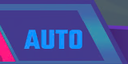 |

> [!NOTE]
> Bad Apple!!'s black-and-white mode, which uses its own sprite, is also supported.

### Options menu text case
This small feature fixes some of the buttons ("Audio", "Streaming Mode", "Goods Store") not being all caps like the rest of the buttons there:
| Before | After |
| --- | --- |
|  | 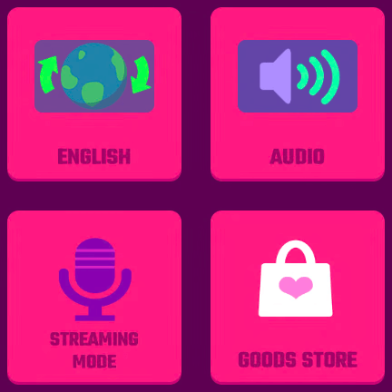 |

> [!NOTE]
> This feature is intended to be used with English locale.

### Achievements header styling
This feature fixes the style of `🏆 N/6` header to match the neighboring "Stage achievements" header, as older versions of Song info used to do:
| _(Context)_ | Before | After |
| --- | --- | --- |
| 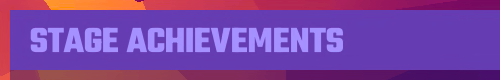 | 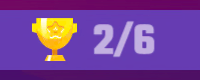 |  |

<details>
<summary>It also adds appearance animations — slide in, fade in — for the counter to match the rest of achievements panel (⅛× playback speed animation, very choppy)</summary>


</details>

> [!NOTE]
> It's currently impossible to apply only style fix or animation, they are treated as one feature.

### Character and elfin select appearance animation
This small feature adds a quick fade in animation for the character and elfin select UI, which otherwise is just displayed while the rest of the panel animates.

<details>
<summary>Comparison (⅛× playback speed animations, very choppy)</summary>

| Before (vanilla version) | After (Scoreboard characters version)
| :---: | :---: |
|  |  |

</details>

> [!NOTE]
> The animation is a work in progress, and may (not) be updated later.

### Configuration
This mod's preferences are used to toggle the mods. In addition, the alternative mode for HP/Fever sync has its own toggle.

The preferences are stored in MelonLoader's default preferences file, `UserData/MelonPreferences.cfg` (relative to game's root directory). Launching the game with the mod installed should create the following section in the file:
```toml
[Bnfour_UITweaks]
# Enables wider album titles on song selection screen.
WiderAlbumTitles = true
# Syncs the spinning cup images for song achievements.
AchievementIconsSync = true
# Syncs the bubble animation for HP and Fever bars.
SyncHpFeverAnim = true
# Syncs HP bar to Fever bar.
SyncHpFeverAnimAlt = false
# Changes text to "AUTO" on the fever bar if automatic fever is enabled.
AutoFeverText = true
# Fixes some texts in options being not uppercase like the rest.
OptionsFullCaps = true
# Restores pre-5.6.0 Song info's achievements header styling
AchievementsHeaderStyling = true
# Adds an appearance animation for the character selector when song details screen is opened
CharacterSelectAnimation = true
```
By default, all toggleable features are enabled. Set a relevant value to `false` to disable a feature.

> [!TIP]
> The mod will notify you when all its features are disabled, and it does nothing.

## Experimental mod (not included in the download)
This is not a mod intended for using. Rather, it's a developmental test bed for me to test random stuff without disruption to existing proper mods. For instance, Album scroll and UI tweaks mods were first implemented (in a very scuffed way; no, I won't show the code ⇀‸↼‶) here and then moved to their own permanent projects.

The project (as published) contains the bare minimum for a mod that is successfully loaded; it does nothing except posting a single message in the log.

# Installation
These are [MelonLoader](https://melonwiki.xyz/) mods. In order to run these, you need to have it installed. Currently, 0.7.0 Open-Beta of MelonLoader is supported.  
Once you have MelonLoader installed, drop the DLLs of desired mods into the `Mods` folder. Remove to uninstall.  

> [!IMPORTANT]
> Scoreboard characters mod also requires SkiaSharp libraries (`libSkiaSharp.dll`, `SkiaSharp.dll`) to be placed in `UserLibs` folder. These libraries are included in the download.

Rather than downloading the mods, I suggest (reviewing the source and) building them yourself — this way you'll be sure the mods behave as described. See ["Building from source"](#building-from-source).  
Otherwise, please verify the downloads.

## Verification
Every published release is accompanied with SHA256 hashes of every DLL. MelonLoader does print these in console when loading mods, but I suggest to verify the hashes before installation.

# Frequently Asked Questions
(or, more accurately, "I thought you may want to know this")

### Is this cheating?
_tl;dr: no_

All mods provide no gameplay advantage whatsoever. You still have to git gud to earn high scores.

- The scoreboard mods show information the game already receives directly from its backend API, it's just not shown anywhere by default.  
You can already get this info, for instance, from [musedash.moe](https://musedash.moe/) scoreboards. In fact, this repo was born from my frustration of having to mirror my track selection in-game to the website on another display.
- Album scroll only affects the song selection menu.
- Song info is simply displaying existing data from the game.
- All UI tweaks are purely cosmetic.

Unless you count _any_ changes to the game for _any_ purpose as cheating, this is not cheating.

### Will I get banned for using these?
_tl;dr: probably not, but NO WARRANTIES; USE AT YOUR OWN RISK_

As I stated in previous question, I don't believe this is cheating. I've been using these continuously for years now, and my account is still there. But there's a reason for the all-caps section of the license about having no warranties: the devs might think otherwise or break the compatibility (un)intentionally.

Remember that you're using the mods **at your own risk**. I have warned you many times in this readme.

### I have other mods. What about compatibility with them?
_tl;dr: ¯\\\_(ツ)\_/¯_

The mods are pretty much self-contained, so I think ("think" being the operative word here) they will work with other mods, unless those other mods change the vanilla code too much.

In case there is a breaking incompatibility with other mods, and it can be traced back to mods from this repo (e.g. errors in the log include mod's name), feel free to open an issue, or, better yet, submit a pull request. We'll see what can be done.

### My game is broken because of you and your mods, how can I fix this and blame you?
_tl;dr: uninstall, and remember: NO WARRANTIES_

If you just want to play the game, removing the mods (and maybe the modloader itself) is always an option.
- Please make sure you're using supported (**0.7.0**) version of MelonLoader.
- Try to remove mods not from this repo.
- Try to remove mods and/or modloader and check whether the vanilla game is broken too.

If none of these helps, feel free to open an issue, unless the problem was already reported.

# Building from source
This repo is a run-of-the-mill .NET solution targeting .NET 6.

The only gotcha is that some libraries required to build it are not included because of file size (and licensing) issues. Your installation of MelonLoader will generate them for you.

Copy everything from `MelonLoader/Il2CppAssemblies` and `MelonLoader/net6` folders from the game install to the `references` folder of this repo. All DLLs should be dumped directly inside the folder, no subfolders needed.

This should cover the local references for all projects. (Actually, **most** of the DLLs are not necessary to build the solution; I just don't plan on keeping an accurate and up to date list of required libraries.)

After that, just run `dotnet build`.

## Enabling SkiaSharp for Scoreboard characters
Scoreboard characters mod uses [SkiaSharp](https://mono.github.io/SkiaSharp/index.html) library ([GitHub](https://github.com/mono/SkiaSharp/), [main package NuGet](https://www.nuget.org/packages/SkiaSharp), [used native libs NuGet](https://www.nuget.org/packages/SkiaSharp.NativeAssets.Win32)) for image editing. Its DLLs (`SkiaSharp.dll`, `libSkiaSharp.dll`) should be placed in `UserLibs` folder of the modded game install. SkiaSharp is MIT-licensed, and I include these in downloads for convenience.

If you want to get these straight from NuGet instead, you can use `dotnet publish` command:
```bash
dotnet publish -c Release -r win-x64 --no-self-contained ScoreboardCharacters/ScoreboardCharacters.csproj
```
The SkiaSharp DLLs will be placed in `ScoreboardCharacters/bin/Release/net6.0/win-x64/publish` folder.

Why `win-x64` runtime? There is no native Muse Dash version for GNU/Linux, and I run the game via Proton, so the Windows binaries should work on both Windows and GNU/Linux for the time being. [Mac? No idea.](https://tenor.com/view/13786657)

You can also extract the DLLs from nupkg files manually. Remember match the version with mod's csproj and look for `net6.0` and `win-x64` monikers.
